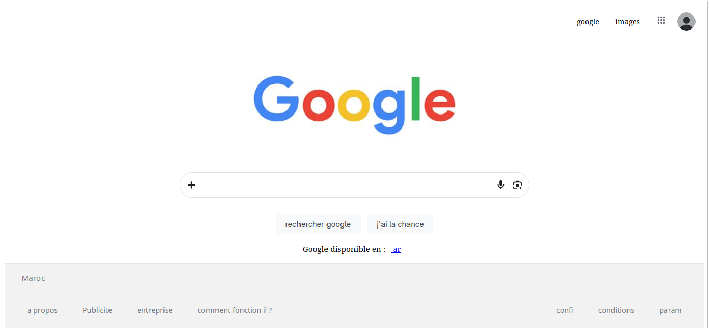

# Clone de la page Google

Une simple reproduction de la page d'accueil de Google en HTML et CSS.

## À propos

C'est un clone front-end de la page principale de Google. Il contient la navbar, la barre de recherche, les boutons et le footer — à peu près tout ce qu'on voit quand on ouvre google.com.

Les images utilisées dans ce projet (logo, photo de profil, etc.) sont prises depuis **google.com**.

## Comment j'ai construit cette page

J'ai développé cette page en utilisant **uniquement HTML et CSS**. J'ai commencé par construire chaque partie séparément, comme le header, puis je les ai stylisées une par une.

Pour le style, je me suis basé sur ma propre expérience. Pour les couleurs et les icônes SVG, j'ai inspecté le site de Google et j'ai copié les couleurs et les icônes directement depuis leur site.

## Comment lancer

Il suffit d'ouvrir `index.html` dans ton navigateur, c'est tout.

